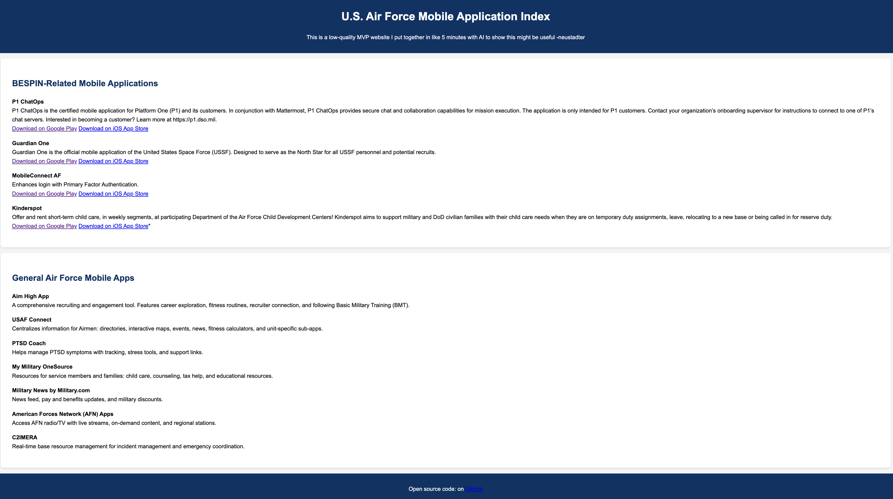

# USAF Mobile Index



**USAF Mobile Index** is an open-source project documenting U.S. Air Force and other military mobile applications. There’s currently no centralized resource for these apps, so this project aims to fill that gap.

---

## Purpose

- Provide a single, accessible resource for Air Force and military-related mobile apps.  
- Help Airmen, recruits, and enthusiasts explore and learn about official mobile tools.  
- Encourage community contributions and updates as new apps are released.

---

## Features

- Comprehensive list of official Air Force apps.  
- Dedicated section for apps developed or supported by **BESPIN**.  
- Inline descriptions, download links, and categories for easy browsing.  
- Lightweight HTML interface for quick reference.  

---

## Usage

1. Clone the repository:

```bash
git clone https://github.com/yourusername/usaf-mobile-index.git
```
Open index.html in your browser.

Scroll through sections to explore Air Force and BESPIN-related mobile apps.

## Contributing
Contributions are welcome! You can help by:

Adding new apps or updating existing entries.

Improving descriptions and links.

Enhancing the HTML layout or interactivity.

Please open a pull request with your changes.

## License
This project is open-source and available under the MIT License.
Feel free to use, modify, and share responsibly.